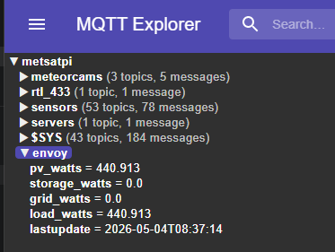

# Enphase Integration

This is a very basic python script to connect to an Enphase Envoy Gateway to retrieve realtime data on the PV, Battery, Grid and overall load, measured in Watts. The data are then published to MQTT. 

The script written for Linux-like OSes but it will also work under windows: you would just need to create a powershell or batch script that does the same as `enphase.sh`. 

## Installation
First install miniconda3 and create a miniconda environment `openhabstuff`. If you want to give the environment a different name you will need to edit the shell script that runs the tool (see later).

Then run
``` bash
conda activate openhabstuff
mkdir ~/src
cd ~/src
git clone https://github.com/markmac99/enphase_integration.git

cd enphase_integration
pip install -r requirements.txt`
```

## Configuration and first run.
To configure your own installation, copy `config.json.sample` to `config.json`, then update the various fields as needed. The meanings should be obvious but at a minimum you must set the MQ host, username, password and port, the Gateway's IP address on your home network and your Enphase username and password (same ones as for the mobile phone or web apps). 

If you used a different miniconda environment name, edit `enphase.sh` to activate the correct name.

You should now be able to run the tool from the commandline, and values should appear in your MQTT server under the topic specified in the config file. 




## Scheduling the process
I run the script every minute via cron:

``` bash
* * * * * $HOME/src/enphase/enphase.sh >> $HOME/logs/enphase.log 2>&1
```

## Exploring the API
There are several requests that can be made to the local API. These are listed in `get_data.ps1`. Edit the file to set the IP address variable then you can run the script or just run each of the individual commands to see what they provide. 

Some sample output is provided in `sample_livedata.json`